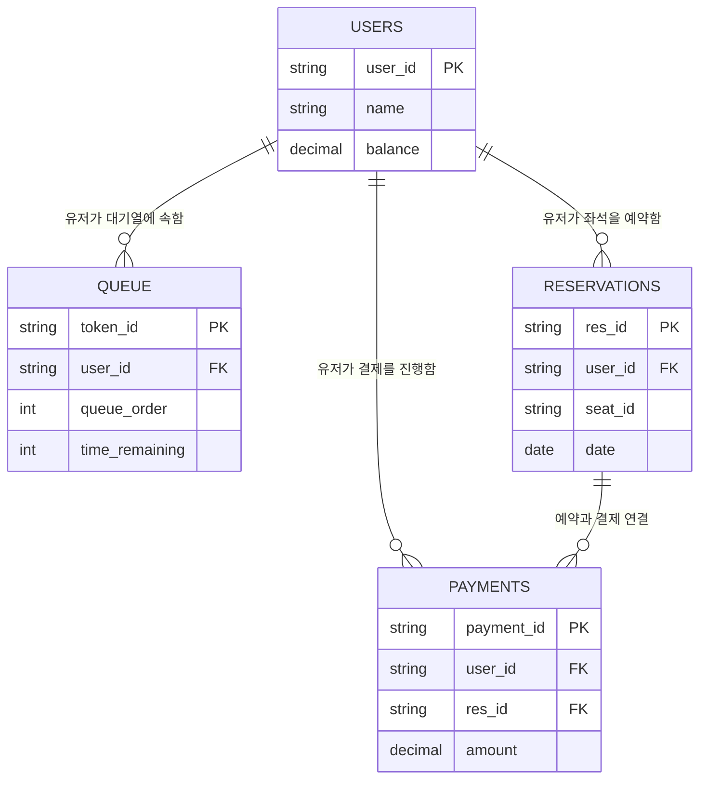

---
## 테이블 설명
### 1. **Users 테이블**

**사용자의 정보와 잔액**을 관리하는 주요 테이블로, 다른 모든 테이블의 주요 참조 대상이 됩니다.

- **필드**:
    - `user_id`: **PK** (Primary Key), 유저를 식별하는 고유 ID
    - `name`: 유저의 이름
    - `email`: 유저의 이메일 주소
    - `balance`: 유저의 현재 잔액

**설명**:

- **Users 테이블**은 유저의 개인 정보(이름)와 결제 시 사용할 잔액(balance)을 관리합니다. 유저의 `user_id`는 다른 모든 서비스에서 참조되어, 대기열, 예약, 결제 등 다양한 기능에서 유저를 식별할 수 있습니다.

---

### 2. **Queue 테이블**

**대기열 시스템에서 유저의 대기 상태**를 관리하는 테이블입니다. 각 유저는 대기열에서 자신의 순서를 부여받고, 남은 대기 시간을 확인할 수 있습니다.

- **필드**:
    - `token_id`: **PK**, 발급된 대기열 토큰의 고유 ID
    - `user_id`: **논리적 FK**, 토큰이 발급된 유저를 식별
    - `queue_order`: 대기열에서 유저의 순서
    - `time_remaining`: 대기열에서 유저가 남은 시간

**설명**:

- **Queue 테이블**은 유저가 대기열에 진입했을 때 발급된 토큰과 대기 상태 정보를 저장합니다. **토큰 ID**로 유저를 식별하고, 대기열의 순서 및 남은 시간을 추적합니다. 이 테이블을 통해 유저가 서비스 이용을 위해 대기 중인 상태를 관리할 수 있습니다.

---

### 3. **Reservations 테이블**

**좌석 예약**과 **날짜 정보**를 관리하는 테이블입니다. 좌석 예약 요청 및 예약 확정 후의 내역을 기록합니다.

- **필드**:
    - `res_id`: **PK**, 예약의 고유 ID
    - `user_id`: **논리적 FK**, 예약한 유저를 식별
    - `seat_id`: 예약된 좌석의 ID
    - `date`: 예약한 날짜

**설명**:

- **Reservations 테이블**은 유저가 좌석을 예약한 내역을 관리합니다. 예약한 좌석(`seat_id`)과 예약 날짜(`date`)를 함께 저장하여 좌석 예약을 추적합니다. 좌석이 임시 예약되거나 확정되었을 때, 이 테이블에서 관리되며 유저가 언제, 어느 좌석을 예약했는지 기록합니다.

---

### 4. **Payments 테이블**

**결제 내역**을 관리하는 테이블입니다. 유저가 좌석을 예약하고 결제한 기록을 저장합니다.

- **필드**:
    - `payment_id`: **PK**, 결제 내역의 고유 ID
    - `user_id`: **논리적 FK**, 결제한 유저를 식별
    - `res_id`: **논리적 FK**, 결제가 연결된 예약 ID
    - `amount`: 결제 금액

**설명**:

- **Payments 테이블**은 유저가 좌석 예약 후 결제한 내역을 기록합니다. **user_id**와 **res_id**를 통해 유저와 예약 정보를 연결하고, 결제 금액(`amount`)을 저장합니다. 결제가 성공적으로 완료되면 예약이 확정되고, 대기열 토큰이 만료됩니다.

---

## 설계 개요

### 1. **Users 테이블**: 모든 서비스와 연관된 주요 엔티티로, 각 서비스는 **user_id**를 기반으로 유저를 식별합니다.

- **QueueService**: `Queue 테이블`을 사용해 대기열 관리 및 토큰 발급, 검증을 담당합니다.
- **ReservationService**: `Reservations 테이블`을 사용해 예약 가능한 날짜와 좌석 상태를 관리하고, 임시 예약 및 확정 예약을 처리합니다.
- **BalanceService**: `Users 테이블`에서 유저의 잔액을 관리하며, 충전 및 결제를 위한 잔액 차감을 담당합니다.
- **PaymentService**: `Payments 테이블`을 사용해 결제 내역을 관리하고, 결제가 완료되면 예약 확정 및 대기열 토큰 만료를 처리합니다.

### 2. **Queue 테이블**: 사용자의 대기열 정보를 관리합니다.

- `user_id`를 통해 논리적으로 유저와 연결되며, 토큰 발급 및 대기열 검증 시 활용됩니다.

### 3. **Reservations 테이블**: 예약된 좌석과 날짜를 관리합니다.

- 좌석 번호(`seat_id`)와 날짜(`date`)를 저장하며, 유저가 특정 날짜에 좌석을 예약한 내역을 기록합니다.

### 4. **Payments 테이블**: 결제 정보를 관리합니다.

- 예약(`res_id`)과 연결된 결제 정보를 저장하며, 유저가 좌석 예약에 대해 결제한 내역을 추적합니다.
