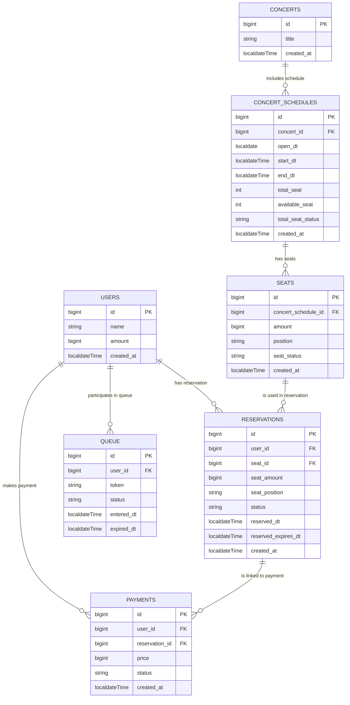

---
## 테이블 설명
### 1. **Users 테이블**

**사용자의 정보와 잔액**을 관리하는 주요 테이블로, 다른 모든 테이블의 주요 참조 대상이 됩니다.

- **필드**:
    - `id`: **PK** (Primary Key), 유저를 식별하는 고유 ID
    - `name`: 유저의 이름
    - `amount`: 유저의 현재 잔액
    - `created_at`: 계정 생성 시간

**설명**:

- **Users 테이블**은 유저의 개인 정보(이름)와 결제 시 사용할 잔액(amount)을 관리합니다. 유저의 `id`는 다른 모든 서비스에서 참조되어, 대기열, 예약, 결제 등 다양한 기능에서 유저를 식별할 수 있습니다.

---

### 2. **Queue 테이블**

**대기열 시스템에서 유저의 대기 상태**를 관리하는 테이블입니다. 각 유저는 대기열에서 자신의 순서를 부여받고, 남은 대기 시간을 확인할 수 있습니다.

- **필드**:
    - `id`: **PK**, 발급된 대기열 고유 ID
    - `user_id`: **논리적 FK**, 토큰이 발급된 유저를 식별
    - `token`: 대기열 토큰
    - `status`: 대기열 상태 (WAITING, PROGRESS, DONE, EXPIRED)
    - `entered_dt`: 대기열 진입 시간
    - `expired_dt`: 대기열 만료 시간

**설명**:

- **Queue 테이블**은 유저가 대기열에 진입했을 때 발급된 토큰과 대기 상태 정보를 저장합니다. **id**로 유저를 식별하고, 대기열의 상태 및 시간을 추적합니다. 이 테이블을 통해 유저가 서비스 이용을 위해 대기 중인 상태를 관리할 수 있습니다.

---

### 3. **Reservations 테이블**

**좌석 예약**과 **날짜 정보**를 관리하는 테이블입니다. 좌석 예약 요청 및 예약 확정 후의 내역을 기록합니다.

- **필드**:
    - `id`: **PK**, 예약의 고유 ID
    - `user_id`: **논리적 FK**, 예약한 유저를 식별
    - `seat_id`: 예약된 좌석의 ID (FK)
    - `seat_amount`: 예약된 좌석의 금액
    - `seat_position`: 좌석의 위치
    - `status`: 예약 상태 (TEMP_RESERVED, RESERVED, CANCELED)
    - `reserved_dt`: 예약 시간
    - `reserved_expires_dt`: 임시 예약의 만료 시간
    - `created_at`: 예약 생성 시간

**설명**:

- **Reservations 테이블**은 유저가 좌석을 예약한 내역을 관리합니다. 좌석 정보와 예약 날짜를 함께 저장하여 예약 상태를 관리하며, 임시 예약이 만료될 경우 자동 해제됩니다.

---

### 4. **Payments 테이블**

**결제 내역**을 관리하는 테이블입니다. 유저가 좌석을 예약하고 결제한 기록을 저장합니다.

- **필드**:
    - `id`: **PK**, 결제 고유 ID
    - `user_id`: **논리적 FK**, 결제한 유저를 식별
    - `reservation_id`: **논리적 FK**, 결제가 연결된 예약 ID
    - `price`: 결제 금액
    - `status`: 결제 상태 (process, done, canceled)
    - `created_at`: 결제 생성 시간

**설명**:
- **Payments 테이블**은 유저가 좌석 예약 후 결제한 내역을 기록합니다. **user_id**와 **reservation_id**를 통해 유저와 예약 정보를 연결하고, 결제 금액(`price`)을 저장합니다. 결제가 성공적으로 완료되면 예약이 확정되고, 대기열 토큰이 만료됩니다.

---

### 5. **Concerts 테이블**

**콘서트 정보**를 관리하는 테이블로, 각각의 콘서트에 대한 기본 정보를 저장합니다.

- **필드**:
    - `id`: **PK** (Primary Key), 콘서트의 고유 ID
    - `title`: 콘서트의 제목
    - `created_at`: 콘서트가 생성된 시간

**설명**:
- **Concerts 테이블**은 콘서트의 기본 정보를 관리합니다. 콘서트의 제목과 생성 일자를 기록하여 각각의 콘서트를 식별할 수 있습니다.

---

### 6. **Concert Schedules 테이블**

**콘서트 일정**을 관리하는 테이블로, 각각의 콘서트 일정에 대한 상세 정보를 저장합니다.

- **필드**:
    - `id`: **PK** (Primary Key), 콘서트 일정의 고유 ID
    - `concert_id`: **FK**, 해당 콘서트를 참조하는 ID
    - `open_dt`: 콘서트의 개최 날짜
    - `start_dt`: 콘서트 시작 시간
    - `end_dt`: 콘서트 종료 시간
    - `total_seat`: 콘서트에서 예약 가능한 총 좌석 수
    - `available_seat`: 예약 가능한 남은 좌석 수
    - `total_seat_status`: 콘서트 좌석 상태 (sold_out, available)
    - `created_at`: 콘서트 일정이 생성된 시간

**설명**:

- **Concert Schedules 테이블**은 콘서트의 특정 일정을 관리하며, 각 콘서트의 시작 시간, 종료 시간, 예약 가능한 좌석 수와 같은 정보를 저장합니다. **concert_id**를 통해 해당 콘서트와 연결됩니다.

---

### 7. **Seats 테이블**

**콘서트 좌석**을 관리하는 테이블로, 각 좌석에 대한 정보 및 상태를 저장합니다.

- **필드**:
    - `id`: **PK** (Primary Key), 좌석의 고유 ID
    - `concert_schedule_id`: **FK**, 해당 콘서트 일정과 연결된 ID
    - `amount`: 좌석 금액
    - `position`: 좌석 위치
    - `seat_status`: 좌석 상태 (available, temp_reserved, reserved)
    - `created_at`: 좌석 정보가 생성된 시간

**설명**:

- **Seats 테이블**은 각각의 콘서트 일정에 대한 좌석 정보를 관리합니다. 좌석의 위치, 금액, 상태를 기록하여 예약 및 결제 시 좌석 상태를 추적할 수 있습니다. **concert_schedule_id**를 통해 콘서트 일정과 연결됩니다.
---

## 설계 개요

- **QueueService**: `Queue 테이블`을 사용해 대기열 관리 및 토큰 발급, 검증을 담당합니다.
- **ReservationService**: `Reservations 테이블`을 사용해 예약 가능한 날짜와 좌석 상태를 관리하고, 임시 예약 및 확정 예약을 처리합니다.
- **BalanceService**: `Users 테이블`에서 유저의 잔액을 관리하며, 충전 및 결제를 위한 잔액 차감을 담당합니다.
- **PaymentService**: `Payments 테이블`을 사용해 결제 내역을 관리하고, 결제가 완료되면 예약 확정 및 대기열 토큰 만료를 처리합니다.
