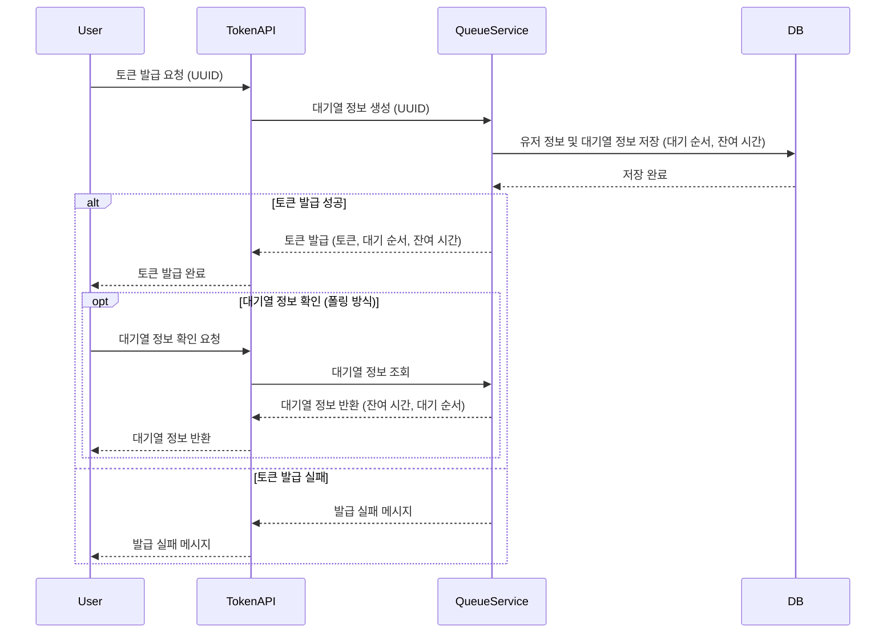
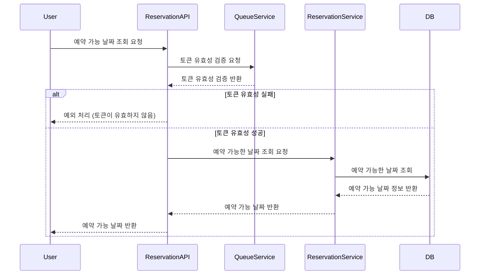
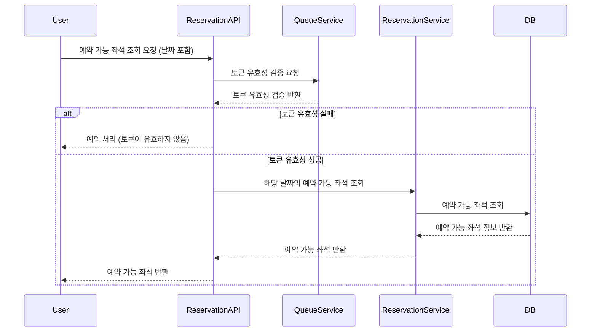
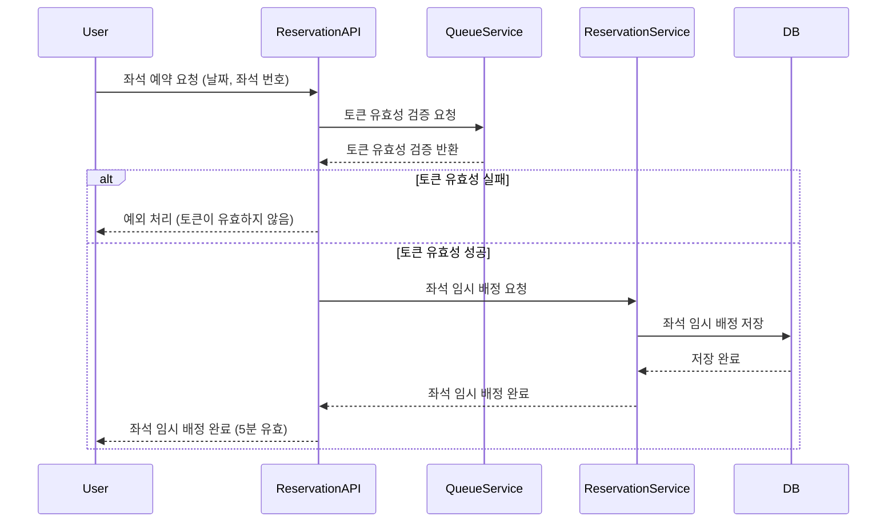
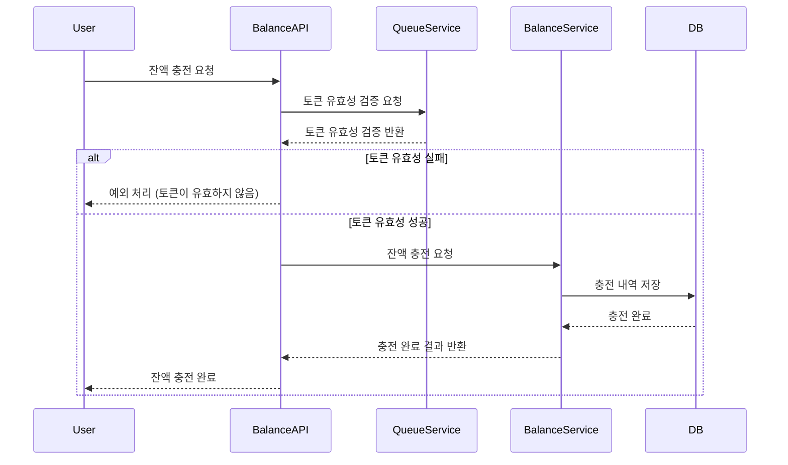
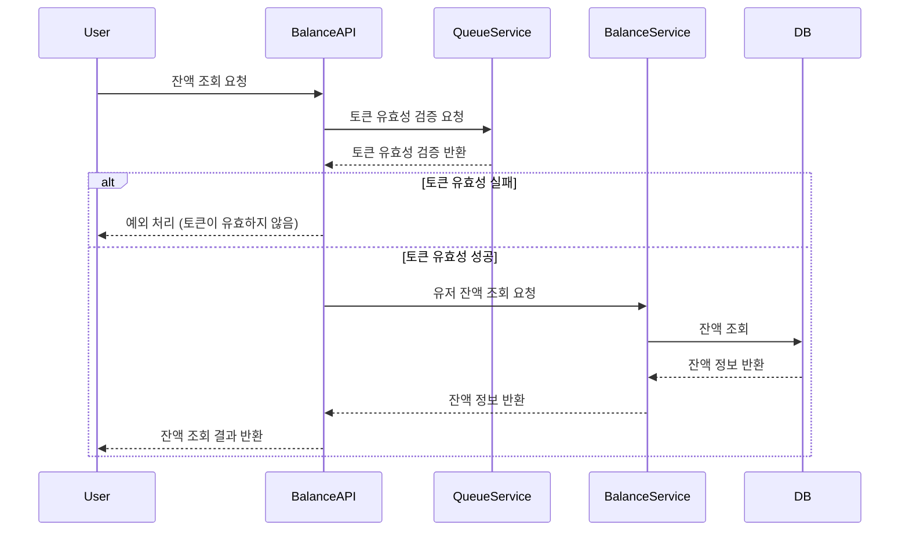
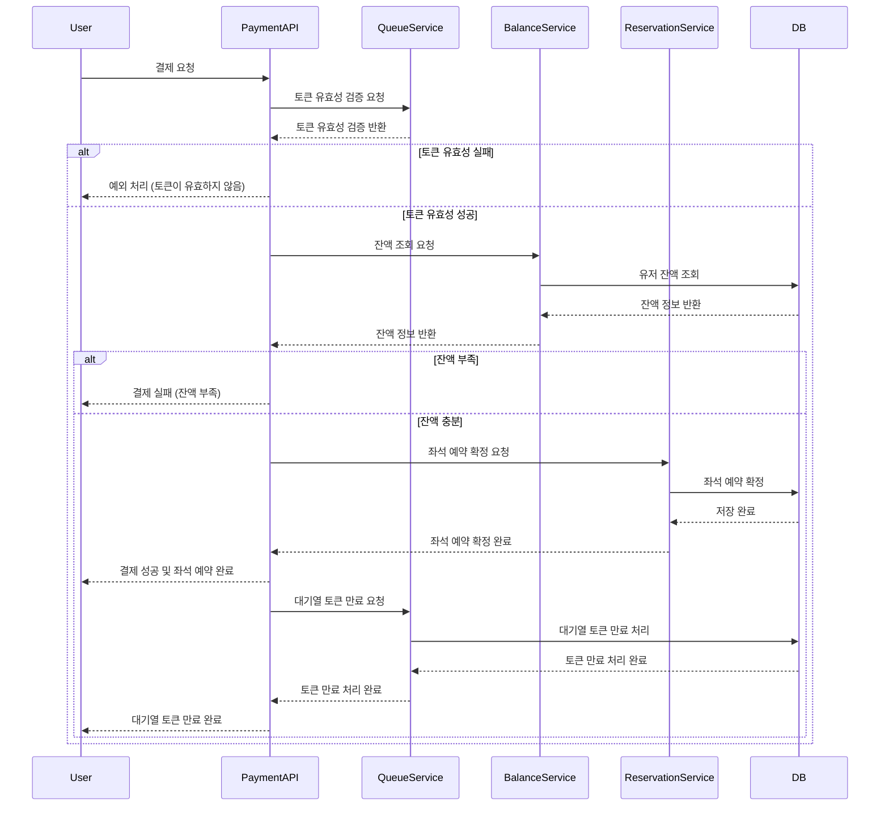

# sequence diagram

---
## 유저 토큰 발급 APi

```mermaid
sequenceDiagram
    participant User
    participant TokenAPI
    participant QueueService
    participant DB

    User->>TokenAPI: 토큰 발급 요청 (UUID)
    TokenAPI->>QueueService: 대기열 정보 생성 (UUID)
    QueueService->>DB: 유저 정보 및 대기열 정보 저장 (대기 순서, 잔여 시간)
    DB-->>QueueService: 저장 완료

    alt 토큰 발급 성공
        QueueService-->>TokenAPI: 토큰 발급 (토큰, 대기 순서, 잔여 시간)
        TokenAPI-->>User: 토큰 발급 완료
        opt 대기열 정보 확인 (폴링 방식)
            User->>TokenAPI: 대기열 정보 확인 요청
            TokenAPI->>QueueService: 대기열 정보 조회
            QueueService-->>TokenAPI: 대기열 정보 반환 (잔여 시간, 대기 순서)
            TokenAPI-->>User: 대기열 정보 반환
        end
    else 토큰 발급 실패
        QueueService-->>TokenAPI: 발급 실패 메시지
        TokenAPI-->>User: 발급 실패 메시지
    end
```

## 예약 가능 날짜 조회 API

```mermaid
sequenceDiagram
    participant User
    participant ReservationAPI
    participant QueueService
    participant ReservationService
    participant DB

    User->>ReservationAPI: 예약 가능 날짜 조회 요청
    ReservationAPI->>QueueService: 토큰 유효성 검증 요청
    QueueService-->>ReservationAPI: 토큰 유효성 검증 반환

    alt 토큰 유효성 실패
        ReservationAPI-->>User: 예외 처리 (토큰이 유효하지 않음)
    else 토큰 유효성 성공
        ReservationAPI->>ReservationService: 예약 가능한 날짜 조회 요청
        ReservationService->>DB: 예약 가능한 날짜 조회
        DB-->>ReservationService: 예약 가능 날짜 정보 반환
        ReservationService-->>ReservationAPI: 예약 가능 날짜 반환
        ReservationAPI-->>User: 예약 가능 날짜 반환
    end
```
## 예약 가능 좌석 조회 API

```mermaid
sequenceDiagram
    participant User
    participant ReservationAPI
    participant QueueService
    participant ReservationService
    participant DB

    User->>ReservationAPI: 예약 가능 좌석 조회 요청 (날짜 포함)
    ReservationAPI->>QueueService: 토큰 유효성 검증 요청
    QueueService-->>ReservationAPI: 토큰 유효성 검증 반환

    alt 토큰 유효성 실패
        ReservationAPI-->>User: 예외 처리 (토큰이 유효하지 않음)
    else 토큰 유효성 성공
        ReservationAPI->>ReservationService: 해당 날짜의 예약 가능 좌석 조회
        ReservationService->>DB: 예약 가능 좌석 조회
        DB-->>ReservationService: 예약 가능 좌석 정보 반환
        ReservationService-->>ReservationAPI: 예약 가능 좌석 반환
        ReservationAPI-->>User: 예약 가능 좌석 반환
    end
```

## 좌석 예약 요청 API

```mermaid
sequenceDiagram
    participant User
    participant ReservationAPI
    participant QueueService
    participant ReservationService
    participant DB

    User->>ReservationAPI: 좌석 예약 요청 (날짜, 좌석 번호)
    ReservationAPI->>QueueService: 토큰 유효성 검증 요청
    QueueService-->>ReservationAPI: 토큰 유효성 검증 반환

    alt 토큰 유효성 실패
        ReservationAPI-->>User: 예외 처리 (토큰이 유효하지 않음)
    else 토큰 유효성 성공
        ReservationAPI->>ReservationService: 좌석 임시 배정 요청
        ReservationService->>DB: 좌석 임시 배정 저장
        DB-->>ReservationService: 저장 완료
        ReservationService-->>ReservationAPI: 좌석 임시 배정 완료
        ReservationAPI-->>User: 좌석 임시 배정 완료 (5분 유효)
    end
```

## 잔액 충전 API

```mermaid
sequenceDiagram
    participant User
    participant BalanceAPI
    participant QueueService
    participant BalanceService
    participant DB

    User->>BalanceAPI: 잔액 충전 요청
    BalanceAPI->>QueueService: 토큰 유효성 검증 요청
    QueueService-->>BalanceAPI: 토큰 유효성 검증 반환

    alt 토큰 유효성 실패
        BalanceAPI-->>User: 예외 처리 (토큰이 유효하지 않음)
    else 토큰 유효성 성공
        BalanceAPI->>BalanceService: 잔액 충전 요청
        BalanceService->>DB: 충전 내역 저장
        DB-->>BalanceService: 충전 완료
        BalanceService-->>BalanceAPI: 충전 완료 결과 반환
        BalanceAPI-->>User: 잔액 충전 완료
    end
```

## 잔액 조회 API

```mermaid
sequenceDiagram
    participant User
    participant BalanceAPI
    participant QueueService
    participant BalanceService
    participant DB

    User->>BalanceAPI: 잔액 조회 요청
    BalanceAPI->>QueueService: 토큰 유효성 검증 요청
    QueueService-->>BalanceAPI: 토큰 유효성 검증 반환

    alt 토큰 유효성 실패
        BalanceAPI-->>User: 예외 처리 (토큰이 유효하지 않음)
    else 토큰 유효성 성공
        BalanceAPI->>BalanceService: 유저 잔액 조회 요청
        BalanceService->>DB: 잔액 조회
        DB-->>BalanceService: 잔액 정보 반환
        BalanceService-->>BalanceAPI: 잔액 정보 반환
        BalanceAPI-->>User: 잔액 조회 결과 반환
    end
```

## 결제 API

```mermaid
sequenceDiagram
    participant User
    participant PaymentAPI
    participant QueueService
    participant BalanceService
    participant ReservationService
    participant DB

    User->>PaymentAPI: 결제 요청
    PaymentAPI->>QueueService: 토큰 유효성 검증 요청
    QueueService-->>PaymentAPI: 토큰 유효성 검증 반환

    alt 토큰 유효성 실패
        PaymentAPI-->>User: 예외 처리 (토큰이 유효하지 않음)
    else 토큰 유효성 성공
        PaymentAPI->>BalanceService: 잔액 조회 요청
        BalanceService->>DB: 유저 잔액 조회
        DB-->>BalanceService: 잔액 정보 반환
        BalanceService-->>PaymentAPI: 잔액 정보 반환

        alt 잔액 부족
            PaymentAPI-->>User: 결제 실패 (잔액 부족)
        else 잔액 충분
            PaymentAPI->>ReservationService: 좌석 예약 확정 요청
            ReservationService->>DB: 좌석 예약 확정
            DB-->>ReservationService: 저장 완료
            ReservationService-->>PaymentAPI: 좌석 예약 확정 완료
            PaymentAPI-->>User: 결제 성공 및 좌석 예약 완료
            PaymentAPI->>QueueService: 대기열 토큰 만료 요청
            QueueService->>DB: 대기열 토큰 만료 처리
            DB-->>QueueService: 토큰 만료 처리 완료
            QueueService-->>PaymentAPI: 토큰 만료 처리 완료
            PaymentAPI-->>User: 대기열 토큰 만료 완료
        end
    end
```
